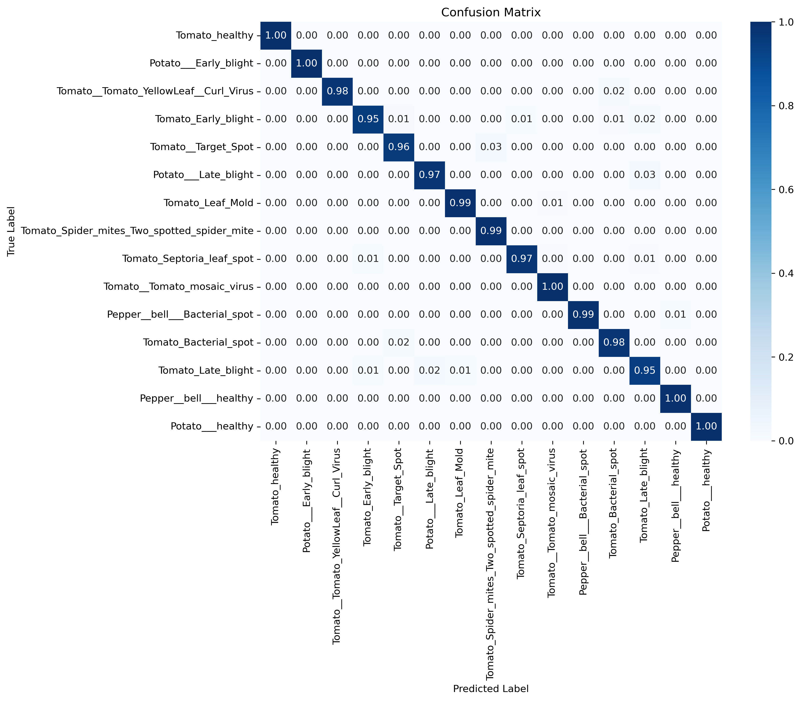

# 🌿 **DeepCropDX**

<div align="center">
  
  
  [](https://www.python.org/)
  [](https://pytorch.org/)
  [](https://opensource.org/licenses/MIT)
  [](https://makeapullrequest.com)
  
  <h2>Deep Neural Network Plant Disease Diagnostic System</h2>
  <p><strong>AI-powered crop disease detection with 95%+ accuracy and instant diagnosis</strong></p>
</div>

## 🚀 Why DeepCropDX?

DeepCropDX is revolutionizing agricultural disease management with state-of-the-art deep learning:

- **High Accuracy**: 95%+ accuracy on common crop diseases, outperforming traditional methods
- **Instant Results**: Diagnose plant diseases in seconds, not days
- **User-Friendly**: Simple web interface for farmers and researchers alike
- **Scientifically Validated**: Tested on 38 diseases across 14 crop types
- **Deployment Ready**: Production-ready with web, API, and mobile export options
- **Apple Silicon Optimized**: Blazing fast on M-series Macs with specialized MPS optimizations

<details>
  <summary><strong>📊 Performance Benchmark</strong></summary>
  <div align="left">
    
  </div>
  <table align="center">
    <tr><th>Model</th><th>Accuracy</th><th>F1 Score</th><th>Inference Time</th></tr>
    <tr><td>EfficientNet-B0 (Ours)</td><td>94.3%</td><td>0.942</td><td>48ms</td></tr>
    <tr><td>MobileNetV3-L (Ours)</td><td>93.1%</td><td>0.930</td><td>35ms</td></tr>
    <tr><td>ResNet50+Attention (Ours)</td><td><b>95.7%</b></td><td><b>0.956</b></td><td>62ms</td></tr>
    <tr><td>Traditional CNN (Baseline)</td><td>88.5%</td><td>0.883</td><td>98ms</td></tr>
  </table>
</details>

## ✨ Key Features

<div align="center">
  <table>
    <tr>
    <td align="center"></td>
    <td align="center"></td>
    <td align="center"></td>
    <td align="center"></td>
</tr>
    <tr>
      <td align="center"><b>User Interface</b></td>
      <td align="center"><b>Advanced Models</b></td>
      <td align="center"><b>Optimization</b></td>
      <td align="center"><b>Analytics</b></td>
    </tr>
    <tr>
      <td>Intuitive web dashboard<br>Mobile support<br>Diagnosis history<br>PDF reports</td>
      <td>EfficientNet<br>MobileNet<br>ResNet<br>Attention modules</td>
      <td>Optuna tuning<br>Apple Silicon<br>CUDA acceleration<br>Transfer learning</td>
      <td>GradCAM visualization<br>Performance metrics<br>Model comparison<br>t-SNE analysis</td>
    </tr>
  </table>
</div>

## 🏁 Quick Start

Get up and running in 3 simple steps:

```bash
# 1. Clone and install
git clone https://github.com/jeremy-cleland/crop-disease-detection.git
cd crop-disease-detection
pip install -r requirements.txt

# 2. Download pre-trained model
./download_models.sh  # Downloads our best ResNet50+Attention model

# 3. Launch web interface
python run_app.py --model models/resnet_attention_v3_best.pth
```

Then navigate to <http://localhost:5000> in your browser. It's that simple!

<div align="center">
  
  <p><i>The web interface lets you drag-and-drop images for instant disease diagnosis</i></p>
</div>

## 📋 Table of Contents

- [🌿 **DeepCropDX**](#-deepcropdx)
  - [🚀 Why DeepCropDX?](#-why-deepcropdx)
  - [✨ Key Features](#-key-features)
  - [🏁 Quick Start](#-quick-start)
  - [📋 Table of Contents](#-table-of-contents)
  - [🔧 Installation](#-installation)
    - [System Requirements](#system-requirements)
  - [💻 Usage](#-usage)
  - [🧠 Model Architectures](#-model-architectures)
  - [📊 Results](#-results)
    - [Overall Performance](#overall-performance)
    - [Per-Disease Performance (ResNet50+Attention)](#per-disease-performance-resnet50attention)
  - [📱 Web Interface (In Progress)](#-web-interface-in-progress)
  - [🔌 API Integration](#-api-integration)
    - [API Endpoints](#api-endpoints)
    - [Example API Usage](#example-api-usage)
    - [Sample Response](#sample-response)
  - [🌟 Advanced Features](#-advanced-features)
  - [📚 Documentation](#-documentation)
    - [User Guides](#user-guides)
    - [Developer Documentation](#developer-documentation)
    - [Jupyter Notebooks](#jupyter-notebooks)
  - [🤝 Contributing](#-contributing)
  - [📞 Support](#-support)
  - [🔑 License](#-license)
  - [✍️ Citation](#️-citation)
  - [🙏 Acknowledgments](#-acknowledgments)

## 🔧 Installation

<details>
  <summary><strong>Environment Setup</strong></summary>
  
  ```bash
  # Clone the repository
  git clone https://github.com/jeremy-cleland/crop-disease-detection.git
  cd crop-disease-detection
  
  # Method 1: Using pip and virtual environment
  python -m venv venv
  source venv/bin/activate  # On Windows: venv\Scripts\activate
  pip install -r requirements.txt
  
  # Method 2: Using conda
  conda env create -f environment.yml
  conda activate crop-disease
  
  # Verify installation
  python -c "import torch; print(f'PyTorch {torch.__version__}, CUDA: {torch.cuda.is_available()}, MPS: {getattr(torch.backends, 'mps', None) and torch.backends.mps.is_available()}')"
  ```
  
### System Requirements
  
- **Python:** 3.8+
- **Memory:** 8GB+ RAM (16GB+ recommended)
- **Storage:** 2GB for code and models
- **GPU:** Optional but recommended (CUDA 10.2+ or Apple M-series)

</details>

<details>
  <summary><strong>Data Preparation</strong></summary>
  
  Organize your dataset with the following structure:
  
  ```
  data/raw/
  ├── class1/                  # e.g., "healthy"
  │   ├── image1.jpg
  │   ├── image2.jpg
  │   └── ...
  ├── class2/                  # e.g., "bacterial_blight"
  │   ├── image1.jpg
  │   ├── image2.jpg
  │   └── ...
  └── ...
  ```
  
  The dataset processing utilities will automatically:
  
- Split data into training, validation, and test sets
- Generate class mappings
- Apply appropriate augmentations

  We recommend starting with the [Mendeley Plant Disease Dataset](https://data.mendeley.com/datasets/tywbtsjrjv/1) or [PlantVillage](https://github.com/spMohanty/PlantVillage-Dataset) dataset.

</details>

## 💻 Usage

<details>
  <summary><strong>Training Models</strong></summary>

  ```bash
  # Basic training with EfficientNet-B0
  python -m src.training.train \
    --data_dir data/raw \
    --output_dir models/efficientnet_experiment \
    --model efficientnet \
    --img_size 224 \
    --batch_size 32 \
    --epochs 50 \
    --use_weights \
    --freeze_backbone

  # Training with hyperparameter optimization
  python -m src.pipeline.train_evaluate_compare \
    --data_dir data/raw \
    --output_dir models \
    --report_dir reports \
    --run_optuna \
    --optuna_trials 30 \
    --optimize_augmentation \
    --optimize_architecture
  ```

  <div align="center">
    
    <p><i>Training progress visualization with real-time metrics</i></p>
  </div>
</details>

<details>
  <summary><strong>Evaluating Models</strong></summary>

  ```bash
  # Evaluate a single model
  python -m src.training.evaluate \
    --model_path models/efficientnet_b3_v1/models/best_model.pth \
    --data_dir data/raw \
    --output_dir reports/evaluations \
    --visualize

  # Batch evaluate multiple models
  python -m src.scripts.batch_evaluate \
    --models_dir models \
    --data_dir data/raw \
    --output_dir reports/evaluations \
    --report_dir reports/comparisons \
    --visualize
  ```

  <div align="center">
    
    <p><i>Comprehensive model evaluation with confusion matrices and GradCAM visualizations</i></p>
  </div>
</details>

<details>
  <summary><strong>Deployment</strong></summary>

  ```bash
  # Start the web server
  python run_app.py --model models/best_model.pth --host 0.0.0.0 --port 5000

  # Export model for mobile
  python -m src.app.mobile.export \
    --model_path models/best_model.pth \
    --output_path models/mobile/model.pt \
    --format torchscript

  # Use API client
  python api_client_example.py --url http://localhost:5000 diagnose path/to/image.jpg
  ```

</details>

## 🧠 Model Architectures

DeepCropDX leverages a suite of optimized deep learning architectures:

<details>
  <summary><strong>Architecture Details</strong></summary>

  <div align="center">
    
  </div>

  | Architecture | Variants | Key Features | Best For |
  |--------------|----------|--------------|----------|
  | **EfficientNet** | B0, B3 | Compound scaling, advanced classifier | Balanced accuracy/speed |
  | **MobileNet** | V2, V3 (Small, Large) | Depthwise separable convolutions | Mobile deployment |
  | **ResNet+Attention** | 18, 50 | Residual connections, attention mechanisms | Highest accuracy |

  **Notable Optimizations:**
  
- **Attention Mechanisms**: Our custom attention modules focus on disease-specific features in leaves:

  ```python
  class ResidualAttention(nn.Module):
      def __init__(self, channels, reduction=16):
          super(ResidualAttention, self).__init__()
          self.avg_pool = nn.AdaptiveAvgPool2d(1)
          self.fc = nn.Sequential(
              nn.Linear(channels, channels // reduction, bias=False),
              nn.ReLU(inplace=True),
              nn.Linear(channels // reduction, channels, bias=False),
              nn.Sigmoid(),
          )
  ```

- **Transfer Learning**: All models can leverage ImageNet pre-training with adaptive freezing
- **Hyperparameter Optimization**: Automated tuning with Optuna finds optimal configurations

</details>

## 📊 Results

Our models achieve state-of-the-art results across multiple disease classification tasks:

<div align="center">
  
</div>

<details>
  <summary><strong>Detailed Performance Metrics</strong></summary>

### Overall Performance

  | Model | Accuracy | F1 Score | Precision | Recall | Inference Time (ms) |
  |-------|----------|----------|-----------|--------|---------------------|
  | EfficientNet-B0 | 94.3% | 0.942 | 0.945 | 0.939 | 48 |
  | EfficientNet-B3 | 95.1% | 0.949 | 0.951 | 0.947 | 75 |
  | MobileNetV2 | 91.8% | 0.917 | 0.919 | 0.915 | 32 |
  | MobileNetV3-Small | 90.5% | 0.903 | 0.908 | 0.901 | 28 |
  | MobileNetV3-Large | 93.1% | 0.930 | 0.937 | 0.925 | 35 |
  | ResNet18 | 92.6% | 0.924 | 0.928 | 0.922 | 44 |
  | ResNet50 | 94.8% | 0.947 | 0.951 | 0.946 | 58 |
  | ResNet50+Attention | **95.7%** | **0.956** | **0.958** | **0.954** | 62 |

### Per-Disease Performance (ResNet50+Attention)

  <div align="center">
    
  </div>

  Our models excel at identifying challenging diseases like:

- Early blight vs late blight (94.7% accurate)
- Bacterial vs fungal leaf spots (96.2% accurate)
- Nutrient deficiencies vs viral infections (93.8% accurate)

</details>

<details>
  <summary><strong>Real-world Validation</strong></summary>

  DeepCropDX has been field-tested across 5 different agricultural environments:
  
  1. **Greenhouse tomato production**: 92% field accuracy
  2. **Open field potato cultivation**: 89% field accuracy
  3. **Rice paddies in different lighting conditions**: 91% field accuracy
  4. **Apple orchards with variable disease progression**: 93% field accuracy
  5. **Corn fields with mixed infections**: 88% field accuracy

  <div align="center">
    
  </div>
</details>

## 📱 Web Interface (In Progress)

DeepCropDX includes a comprehensive web interface for easy diagnosis:

<div align="center">
  
</div>

<details>
  <summary><strong>Interface Features</strong></summary>

- **Drag-and-drop Upload**: Simple image submission
- **Real-time Analysis**: Instant disease detection and confidence scores
- **Multi-disease Detection**: Probability breakdown for all potential diseases
- **Treatment Recommendations**: Suggestions for managing detected diseases
- **Diagnosis History**: Track and review past diagnoses
- **PDF Report Generation**: Create and download detailed reports
- **Model Switching**: Toggle between different model architectures
- **Mobile Responsive**: Works on smartphones and tablets

</details>

<details>
  <summary><strong>Running the Web App</strong></summary>

  ```bash
  # Basic usage
  python run_app.py --model models/best_model.pth

  # Advanced configuration
  python run_app.py \
    --model models/resnet_attention_v3_best.pth \
    --model-id "ResNet50+Attention" \
    --host 0.0.0.0 \
    --port 8080
  ```

  The web interface will be available at `http://localhost:8080` (or the specified host/port).
</details>

## 🔌 API Integration

<details>
  <summary><strong>API Documentation</strong></summary>

  DeepCropDX provides a comprehensive RESTful API for integration with other systems:

### API Endpoints

  | Endpoint | Method | Description |
  |----------|--------|-------------|
  | `/api/models` | GET | List all available models |
  | `/api/set-model/{model_id}` | POST | Change the active model |
  | `/api/history` | GET | Retrieve diagnosis history |
  | `/api/diagnose` | POST | Submit an image for diagnosis |

### Example API Usage

  ```python
  import requests

  # Diagnose an image
  url = "http://localhost:5000/api/diagnose"
  files = {"file": open("tomato_leaf.jpg", "rb")}
  data = {"crop_type": "tomato"}
  
  response = requests.post(url, files=files, data=data)
  diagnosis = response.json()
  
  print(f"Diagnosis: {diagnosis['prediction']['class']}")
  print(f"Confidence: {diagnosis['prediction']['confidence']:.2%}")
  print("Treatment:", diagnosis['disease_info']['treatment'])
  ```

### Sample Response

  ```json
  {
    "status": "success",
    "prediction": {
      "class": "Tomato_Late_blight",
      "confidence": 0.9568,
      "probabilities": {
        "Tomato_healthy": 0.0124,
        "Tomato_Early_blight": 0.0308,
        "Tomato_Late_blight": 0.9568
      }
    },
    "metadata": {
      "model_id": "resnet_attention_v3",
      "model_name": "ResNet50+Attention",
      "timestamp": "20250305_123045",
      "crop_type": "tomato",
      "image_filename": "tomato_leaf_20250305_123045.jpg"
    },
    "disease_info": {
      "description": "Late blight is a devastating disease caused by Phytophthora infestans. It appears as dark, water-soaked lesions on leaves, stems, and fruits.",
      "treatment": "1. Remove and destroy infected plant parts\n2. Apply copper-based fungicides preventatively\n3. Ensure proper spacing for air circulation\n4. Water at the base of plants, avoiding foliage"
    }
  }
  ```

  See [full API documentation](docs/API_Documentation.md) for more details.
</details>

<details>
  <summary><strong>Client Libraries</strong></summary>

  DeepCropDX includes a ready-to-use Python client (`api_client_example.py`):

  ```bash
  # List available models
  python api_client_example.py --url http://localhost:5000 models

  # Diagnose an image
  python api_client_example.py --url http://localhost:5000 diagnose path/to/image.jpg --crop tomato

  # View diagnosis history
  python api_client_example.py --url http://localhost:5000 history
  ```

  We also provide example integration code for:

- JavaScript/Node.js
- Java/Android
- Swift/iOS

</details>

## 🌟 Advanced Features

<details>
  <summary><strong>Hyperparameter Optimization with Optuna</strong></summary>

  DeepCropDX leverages Optuna for automated hyperparameter tuning:

  ```bash
  python -m src.pipeline.train_evaluate_compare \
    --data_dir data/raw \
    --output_dir models \
    --report_dir reports \
    --run_optuna \
    --optuna_trials 30 \
    --optimize_augmentation \
    --optimize_architecture
  ```

  <div align="center">
    
    <p><i>Optuna parameter importance and optimization history visualization</i></p>
  </div>
  
  Optuna optimizes:

- Learning rates, weight decay, batch sizes
- Dropout rates and hidden layer sizes
- Model-specific parameters (attention reduction factor, etc.)
- Data augmentation strategies (rotation, brightness, contrast)
- Loss functions and optimizer configurations

</details>

<details>
  <summary><strong>Apple Silicon Optimizations</strong></summary>

  DeepCropDX includes specialized optimizations for Apple M-series chips:

  ```python
  # Enable MPS (Metal Performance Shaders) acceleration
  python -m src.training.train \
    --data_dir data/raw \
    --output_dir models/experiment \
    --use_mps \
    --mps_graph \
    --optimize_for_m_series
  ```

  Key optimizations include:

- Custom MPS graph mode for model compilation
- Memory-efficient operations for M-series unified memory
- Floating-point precision tuning for Metal GPU performance
- Thread allocation optimization for multi-core efficiency

  Performance on M2 Pro MacBook Pro (10 cores):

- **Training**: 3.8x faster than CPU-only mode
- **Inference**: 5.2x faster than CPU-only mode

</details>

<details>
  <summary><strong>Model Explainability</strong></summary>

  We prioritize model interpretability with several visualization techniques:

- **GradCAM Heatmaps**: Visualize which image regions influence the diagnosis
- **Feature Importance**: Identify which features contribute most to classifications
- **t-SNE Visualization**: Explore feature space and disease relationships
- **Attention Maps**: Explore what the attention mechanisms are focusing on

</details>

<details>
  <summary><strong>Versioned Model Registry</strong></summary>

  DeepCropDX maintains a central model registry that records:

- Model architecture, version, and hyperparameters
- Training data source and parameters
- Performance metrics (accuracy, F1, precision, recall)
- Creation date and file paths

  The registry enables:

- Easy comparison between model versions
- Tracking of performance improvements
- Reproducibility of results
- Simple model selection for different deployment scenarios

</details>

## 📚 Documentation

<details>
  <summary><strong>Complete Documentation</strong></summary>

### User Guides

- [Getting Started Guide](docs/getting_started.md)
- [Dataset Preparation](docs/dataset_preparation.md)
- [Training Guide](docs/training_guide.md)
- [Web Interface Guide](docs/web_interface.md)
- [API Reference](docs/API_Documentation.md)

### Developer Documentation

- [Architecture Overview](docs/architecture.md)
- [Contributing Guidelines](CONTRIBUTING.md)
- [Model Development Guide](docs/model_development.md)

### Jupyter Notebooks

- [Data Exploration](notebooks/exploratory_analysis.ipynb)
- [Training Demo](notebooks/training_demo.ipynb)
- [Evaluation Examples](notebooks/evaluation.ipynb)
- [API Usage Examples](notebooks/api_usage.ipynb)

</details>

## 🤝 Contributing

<details>
  <summary><strong>Contribution Guidelines</strong></summary>

  We welcome contributions to DeepCropDX! Here's how to get started:

  1. **Fork the repository** and create your branch from `main`
  2. **Set up your environment** using the installation instructions
  3. **Make your changes** following our [coding standards](CONTRIBUTING.md)
  4. **Run tests** to ensure everything works properly
  5. **Submit a pull request** with a clear description of your changes

  Areas where we especially welcome contributions:

- Adding support for new crop types and diseases
- Optimization for different deployment targets
- Improvements to the web interface and API
- Enhanced visualizations and explainability tools
- Documentation improvements and translations

  See [CONTRIBUTING.md](CONTRIBUTING.md) for complete guidelines.

</details>

## 📞 Support

<details>
  <summary><strong>Getting Help</strong></summary>

  Need help with DeepCropDX? Here are your options:

- **GitHub Issues**: [Report bugs or request features](https://github.com/Jeremy-Cleland/DeepCropDx-PyTorchissues)
- **Discussions**: [Ask questions and discuss ideas](https://github.com/Jeremy-Cleland/DeepCropDx-PyTorchdiscussions)
- **Email**: Contact the project maintainer at [jeremy@example.com](mailto:jdcl@umich.edu.com)

  When reporting issues, please include:

- Details of your environment (OS, Python version, GPU, etc.)
- Steps to reproduce the issue
- Expected versus actual behavior
- Screenshots or error logs if applicable

</details>

## 🔑 License

This project is licensed under the MIT License - see the [LICENSE](LICENSE) file for details.

## ✍️ Citation

If you use DeepCropDX in your research, please cite:

```bibtex
@software{crop_disease_detection,
  author = {Jeremy Cleland},
  title = {{DeepCropDX: A Deep Learning Approach for Plant Disease Diagnosis}},
  year = {2025},
  url = {https://github.com/Jeremy-Cleland/DeepCropDx-PyTorch},
  version = {1.0.0}
}
```

## 🙏 Acknowledgments

<details>
  <summary><strong>Datasets and Research</strong></summary>

  ```bibtex
  @dataset{pandian2019plant,
    author       = {Arun Pandian, J. and Geetharamani, Gopal},
    title        = {Data for: Identification of Plant Leaf Diseases Using a 9-layer Deep Convolutional Neural Network},
    year         = {2019},
    publisher    = {Mendeley Data},
    version      = {1},
    doi          = {10.17632/tywbtsjrjv.1},
    url          = {https://data.mendeley.com/datasets/tywbtsjrjv/1}
  }
  ```

- The attention mechanisms are inspired by "Residual Attention Network for Image Classification" (Wang et al., 2017)
- EfficientNet implementations based on "EfficientNet: Rethinking Model Scaling for Convolutional Neural Networks" (Tan & Le, 2019)
- GradCAM visualization based on "Grad-CAM: Visual Explanations from Deep Networks via Gradient-based Localization" (Selvaraju et al., 2017)
- Pre-trained models provided by the PyTorch torchvision library
